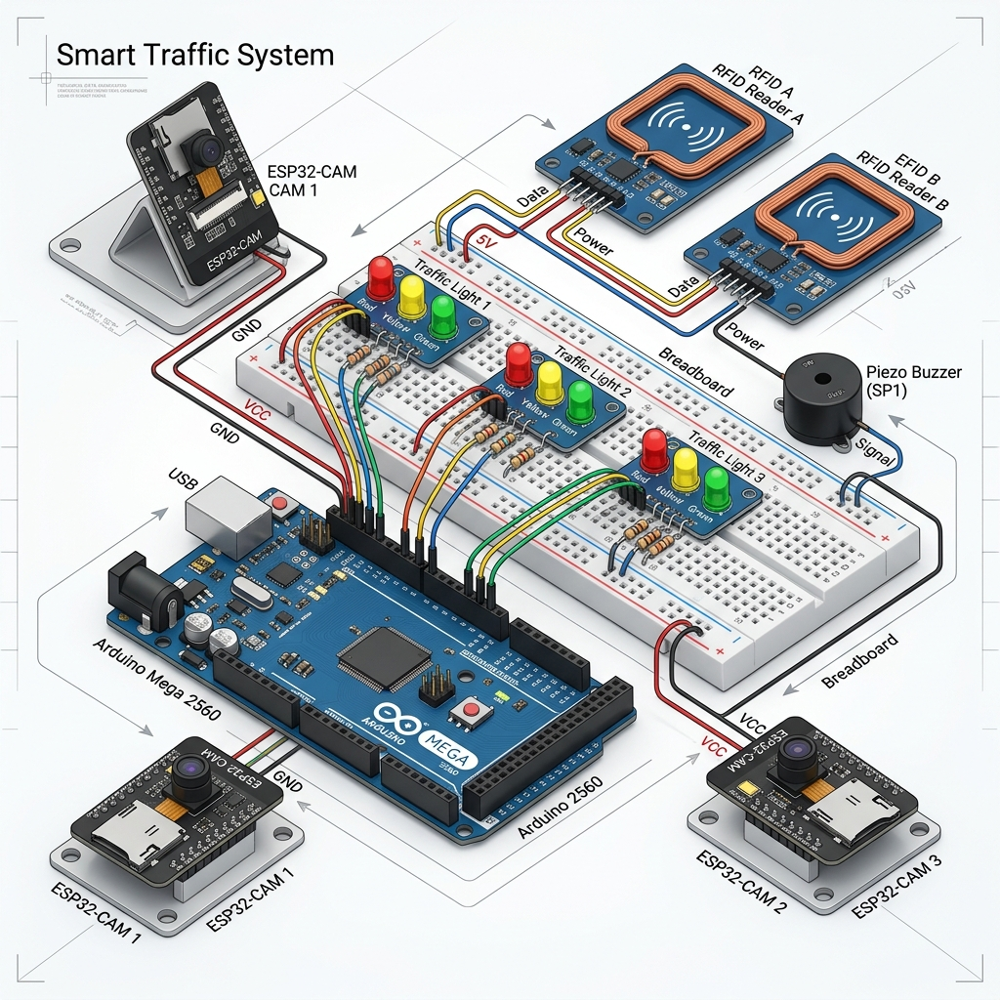

# 🚦 GiveWay: Master Hardware Connection & Logic Guide

This is your **Complete Integrated Guide** for building the GiveWay Adaptive Traffic Equity System (ATES). It combines the high-level technical pinouts with a physical breadboard wiring model and a detailed programming logic explanation.

---

## 🖼️ Phase 1: Technical Schematic (Pinout Mapping)
This diagram shows the "Digital Blueprint" of your system. Every pin on the Arduino Mega is mapped to its specific function.

---

## 📥 Phase 2: The "Clear Cut" Wiring Plan
Connect your components in this exact order to ensure the shared ground is stable.

### 🔴 Lane 1: South Approach
- [ ] **Signal Red**: Arduino **Pin 8** $\rightarrow$ 220Ω Resistor $\rightarrow$ LED Anode.
- [ ] **Signal Yellow**: Arduino **Pin 9** $\rightarrow$ 220Ω Resistor $\rightarrow$ LED Anode.
- [ ] **Signal Green**: Arduino **Pin 10** $\rightarrow$ 220Ω Resistor $\rightarrow$ LED Anode.
- [ ] **RFID Reader A**: EM-18 TX $\rightarrow$ Arduino **Pin A4** (Analog 4).

### 🟠 Lane 2: East Approach
- [ ] **Signal Red**: Arduino **Pin 11** $\rightarrow$ 220Ω Resistor $\rightarrow$ LED Anode.
- [ ] **Signal Yellow**: Arduino **Pin 12** $\rightarrow$ 220Ω Resistor $\rightarrow$ LED Anode.
- [ ] **Signal Green**: Arduino **Pin 13** $\rightarrow$ 220Ω Resistor $\rightarrow$ LED Anode.
- [ ] **RFID Reader B**: EM-18 TX $\rightarrow$ Arduino **Pin A3** (Analog 3).

### 🟡 Lane 3: West Approach (AI Logic)
- [ ] **Signal Red**: Arduino **Pin 14** (A0) $\rightarrow$ 220Ω Resistor $\rightarrow$ LED Anode.
- [ ] **Signal Yellow**: Arduino **Pin 15** (A1) $\rightarrow$ 220Ω Resistor $\rightarrow$ LED Anode.
- [ ] **Signal Green**: Arduino **Pin 16** (A2) $\rightarrow$ 220Ω Resistor $\rightarrow$ LED Anode.

### 🚨 System Master
- [ ] **Buzzer**: Arduino **Pin 22** $\rightarrow$ Positive (+) Leg.
- [ ] **Shared Ground**: Arduino **GND** $\rightarrow$ Breadboard (-) Rail.

---

## 🍞 Phase 3: Breadboard Wiring Model (830-Points)
Use this section to organize the physical placement on your **full-sized breadboard**.

### 🗺️ Virtual Breadboard Map
| Location | Component | Connection Logic |
| :--- | :--- | :--- |
| **Top Rails** | Power Bus | Bridge the Red (+) and Blue (-) rails from Top to Bottom. |
| **Zone A (Left)** | **RFID Module 1** | Wire TX to A4. Supply 5V from the rail. |
| **Zone B (Center)** | **9-LED Signal Core** | Space out LEDs into 3 clusters. Use common ground. |
| **Zone C (Right)** | **RFID Module 2** | Wire TX to A3. Supply 5V from the rail. |
| **Upper Corner** | **Piezo Buzzer** | Wire (+) to Pin 22. Wire (-) to Ground Rail. |

---

## 🧠 Phase 4: Programming Logic & Flow

The GiveWay system is not just a timer; it is an **AI-Driven Infrastructure**.

### 1. The Decision Engine (Adaptive Timing)
The system calculates Green phases based on **PCE (Passenger Car Equivalent)** weighting.
- **Low Traffic**: 15s Base Green.
- **High Traffic**: Up to 45s (calculated by the Node.js server using ESP32-CAM density).

### 2. The Emergency Interrupt (Priority)
If an RFID tag is swiped (Lane 1 or 2), the Arduino detects the serial pulse and sends an interrupt to the server. The server instantly overrides the current cycle and forces the **Priority Lane to Green**.

### 3. Safety Clearance (All-Red)
To prevent cross-traffic accidents, there is a **1-second All-Red window** between every signal change. This ensures the junction is clear before the next lane proceeds.

### 4. Ghost Lane Accident Detection
If the server detects a Green lane has 0% flow for 10 seconds, it triggers **Pin 22 (Buzzer)** to alert local traffic and logs an accident on the Command Center dashboard.

---

## 🏗️ Technical Specifications & Tips
- **EM-18 RFID**: Ensure the **SEL Pin** is connected to **GND** for TTL-mode communication.
- **ESP32-CAM**: Power these directly from the breadboard rails. Ensure they are on a 5V supply with at least 2A current capacity total.
- **Resistors**: Always use resistors (220Ω - 330Ω) on the ground side of your LEDs to prevent overheating.

**You have everything you need. The blueprint is integrated, the pins are verified, and the logic is mapped. Good luck with the build!**
