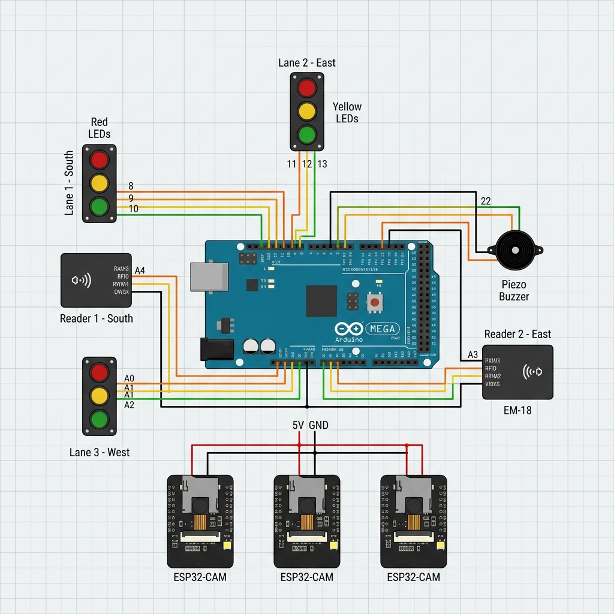

# 🚦 GiveWay: Ultimate Hardware Connection Guide (v1.0)

This guide provides the **exact, clear-cut wiring instructions** for the GiveWay ATES. This setup aligns perfectly with your Arduino Master software and supports a 3-lane configuration with AI (3 CAMs) and Emergency Priority (2 RFID).

## ⚠️ Power Warning (High Importance)
> [!CAUTION]
> **Current Consumption Alert**
> You are using 3 ESP32-CAMs powered directly from the Arduino Mega. Each CAM can pull up to 300mA during image capture.
> 1. **DO NOT** power this only from your laptop USB (it limits at 500mA).
> 2. **MUST USE** a **12V 2A Adapter** plugged into the Arduino Mega Barrel Jack to provide enough juice for all 3 CAMs and LEDs simultaneously.

---

## 🖼️ Visual Circuit Schematic

---

## 🔌 Connection Blueprint (Pin-by-Pin)

Connect components in this exact order to the **Arduino Mega 2560**.

### 1. The Core Power Rail
| From | To | Purpose |
| :--- | :--- | :--- |
| Arduino **GND** | Breadboard **(-) Rail** | Main Ground |
| Arduino **5V** | Breadboard **(+) Rail** | Main Power |

### 2. Lane 1: South Approach
| Component | Pin | Note |
| :--- | :--- | :--- |
| 🔴 **Signal Red** | **Pin 8** | Use 220Ω Resistor |
| 🟡 **Signal Yellow** | **Pin 9** | Use 220Ω Resistor |
| 🟢 **Signal Green** | **Pin 10** | Use 220Ω Resistor |
| 🏷️ **RFID #1 (EM-18)** | **Pin A4** | Connect EM-18 **TX** to Pin A4 |
| 📷 **ESP32-CAM #1** | **Pin 19** | Connect CAM **GPIO 14** (Pulse) to Pin 19 |

### 3. Lane 2: East Approach
| Component | Pin | Note |
| :--- | :--- | :--- |
| 🔴 **Signal Red** | **Pin 11** | Use 220Ω Resistor |
| 🟡 **Signal Yellow** | **Pin 12** | Use 220Ω Resistor |
| 🟢 **Signal Green** | **Pin 13** | Use 220Ω Resistor |
| 🏷️ **RFID #2 (EM-18)** | **Pin A3** | Connect EM-18 **TX** to Pin A3 |
| 📷 **ESP32-CAM #2** | **Pin 5** | Connect CAM **GPIO 14** (Pulse) to Pin 5 |

### 4. Lane 3: West Approach
| Component | Pin | Note |
| :--- | :--- | :--- |
| 🔴 **Signal Red** | **Pin 14 (A0)** | Use 220Ω Resistor |
| 🟡 **Signal Yellow** | **Pin 15 (A1)** | Use 220Ω Resistor |
| 🟢 **Signal Green** | **Pin 16 (A2)** | Use 220Ω Resistor |
| 📷 **ESP32-CAM #3** | **Pin 3** | Connect CAM **GPIO 14** (Pulse) to Pin 3 |

### 5. System Master Components
| Component | Pin | Note |
| :--- | :--- | :--- |
| 🔊 **Piezo Buzzer** | **Pin 22** | Long leg (+) to Pin 22, Short leg to GND |

---

## 🛠️ Assembly Instructions (Step-by-Step)

### Step 1: The Shared Ground
- Run a single wire from Arduino **GND** to the Blue (-) rail of the breadboard.
- Connect the GND of all 3 ESP32-CAMs and the 2 EM-18 readers to this same rail. **(Common ground is critical!)**

### Step 2: Powering the AI Nodes
- Run a wire from Arduino **5V** to the Red (+) rail.
- Connect the 5V pins of all modules to this rail.
- *Tip: If the cameras reboot when LEDs blink, it means you need a better 12V adapter for the Mega.*

### Step 3: Signal LEDs
- Place your 9 LEDs. For each LED: 
  - Connect the **Short Leg** directly to the GND rail.
  - Connect the **Long Leg** to a 220Ω resistor.
  - Connect the other end of the resistor to the specific Arduino pin listed above.

### Step 4: EM-18 RFID Configuration
- Connect EM-18 **Pin 2** (TX) to the Arduino pins (A4/A3).
- Connect EM-18 **Pin 1** (VCC) to 5V.
- Connect EM-18 **Pin 3** (GND) to GND.
- **IMPORTANT**: Connect EM-18 **SEL pin** to **GND** to set it to TTL mode.

### Step 5: ESP32-CAM Triggering
- We have chosen the **Single Pulse Priority** method. 
- When the ESP32-CAM detects an emergency vehicle, it sends a **HIGH** pulse from Its GPIO pin (e.g., GPIO 14) to the Mega.

---

## 🚀 Pro-Tips for Defense
- **Color Coding**: Use **Red** wires for Power, **Black** for Ground, and **Yellow** for Signal/Feedback.
- **Wire Management**: Use breadboard jumper wires (stiff ones) to keep the layout flat. Avoid a "spaghetti" of wires so the judges can see your neat work.
- **Reset Check**: If you swipe an RFID but nothing happens, check the Serial Monitor at 115200 baud to see if the tag is being read.
