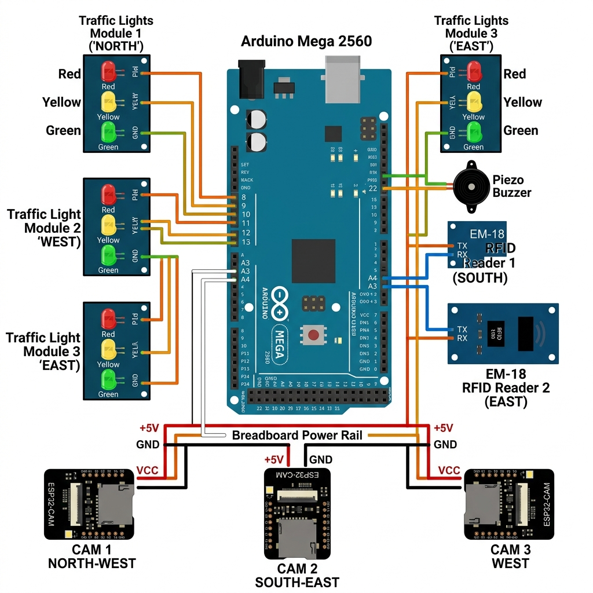

# 🛠️ GiveWay Hardware: Beginner's Connection Guide

This guide details the physical assembly and logical framework for your **3-Way Adaptive Traffic Equity System (ATES)** using the Arduino Mega 2560.

---

## 📥 1. Exact Pin-by-Pin Wiring Checklist

Connect these wires one by one. Do not proceed to the next lane until the current one is fully wired.

### 🔴 Lane 1: South Approach
- [ ] Connect **Pin 8** to the Red LED Resistor.
- [ ] Connect **Pin 9** to the Yellow LED Resistor.
- [ ] Connect **Pin 10** to the Green LED Resistor.
- [ ] Connect **Pin A4** (Analog 4) to the **TX pin** of EM-18 Reader #1.

### 🟠 Lane 2: East Approach
- [ ] Connect **Pin 11** to the Red LED Resistor.
- [ ] Connect **Pin 12** to the Yellow LED Resistor.
- [ ] Connect **Pin 13** to the Green LED Resistor.
- [ ] Connect **Pin A3** (Analog 3) to the **TX pin** of EM-18 Reader #2.

### 🟡 Lane 3: West Approach (AI Node)
- [ ] Connect **Pin 14 (A0)** to the Red LED Resistor.
- [ ] Connect **Pin 15 (A1)** to the Yellow LED Resistor.
- [ ] Connect **Pin 16 (A2)** to the Green LED Resistor.

### 🚨 System Core
- [ ] Connect **Pin 22** to the Positive (+) leg of the Piezo Buzzer.
- [ ] Connect **GND rail** on breadboard to **Arduino GND pin**.
- [ ] Connect **5V rail** on breadboard to **Arduino 5V pin**.

---

## 🍞 2. Breadboard Real Estate (830-Point Layout)

Since you are using a **full-sized breadboard**, you have enough room for all components, but you must bridge the power rails to ensure the entire board has electricity.

### A. Power Rail Bridging
- Most full-sized breadboards have a break in the middle of the power rails. 
- **Bridge them**: Connect a jumper wire from the Top Red (+) rail to the Bottom Red (+) rail. 
- **Repeat for Ground**: Connect the Top Blue (-) rail to the Bottom Blue (-) rail. This ensures that a component plugged into the bottom corner still gets power from the Arduino.

### B. Module Zoning
- **Left Side**: Place RFID Reader 1 (A4) here. 
- **Center**: Place your 9 LEDs (Signals) here.
- **Right Side**: Place RFID Reader 2 (A3) here.
- **Corners**: Use the corners for your ESP32-CAM modules to give them a clear view of the approaches.

---

## ⚡ 3. Power & Grounding (Critical)
1. **Common Ground**: You **MUST** connect the GND pin of the Arduino, the GND rail of the breadboard, and the GND pins of all ESP32-CAMs together. Without a shared ground, the signals will flicker or fail.
2. **Current Protection**: Place one **220Ω resistor** in series with the long leg (anode) of every LED to prevent them from burning out.
3. **Power Supply**:
   - For programming: Connect the **USB B cable** to your Desktop.
   - For stability: Plug the **12V power adapter** into the Arduino's barrel jack. This ensures the ESP32-CAMs have enough current to process images.

---

## 🧠 4. Programming Logic (Adaptive Algorithm)

The GiveWay system follows a **Cloud-Master-Node** architecture. Here is how your code should behave:

### Step 1: The Sensing Phase (ESP32-CAM)
The ESP32-CAM takes a snapshot, runs it through the YOLOv8 model, and identifies the vehicle types. It assigns **PCE (Passenger Car Equivalent)** weights:
- **Ambulance**: 500 (Priority Infinite)
- **Bus**: 15 | **Lorry**: 8 | **Car**: 1 | **Bike**: 0.5

### Step 2: The Decision Logic (Node.js Server)
The server receives weights from all 3 lanes. It calculates the **Priority Score** for each lane:
$$\text{Green Time} = \text{Base (15s)} + (\text{PCE Density} \times \text{Multiplier})$$
The server then sends a command like `1G` (Lane 1 Green) to the Arduino via Serial.

### Step 3: The Execution (Arduino Mega)
The Arduino acts as the "Muscle":
- **Command Handling**: It listens for `G`, `Y`, `R` commands via Serial and toggles the LEDs.
- **Interrupts**: If an RFID tag is swiped (Lane 1 or 2), the Arduino instantly skips everything and sends a message back to the server: `HW_RFID:1:TAG_ID`.
- **Accident Alert**: If the server sends `B`, the Arduino sounds the buzzer on Pin 22.

---

## 🏗️ Implementation Tips
- **Wiring Tip**: Use color-coded wires! Red for 5V, Black for GND, and Yellow/Green/Orange for the signals to keep your breadboard organized.
- **Breadboard Tip**: Avoid "jumper nests." Keep your wires flat against the board. This makes it easier to troubleshoot if an LED doesn't blink.
- **Calibration**: Ensure the ESP32-CAM is mounted at a height where it can see at least 5-10 meters of the lane for accurate vehicle counting.

**Your hardware is now logically and physically mapped for a full-sized breadboard setup. You are ready to assemble!**
